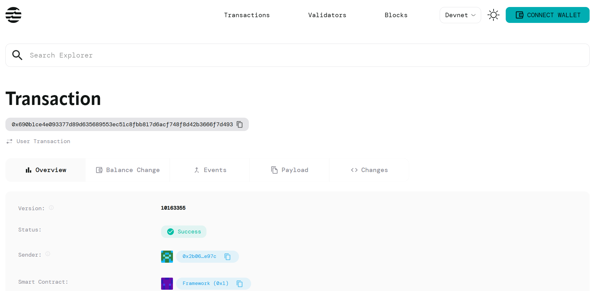

# String Utilities

## Project Description

The String Utilities smart contract is a Move-based application built for the Aptos blockchain that provides essential string manipulation and formatting functions. This contract enables users to perform common string operations such as concatenation and length calculation in a decentralized environment, while maintaining operation tracking and data persistence on the blockchain.

## Project Vision

Our vision is to provide developers and users with a reliable, efficient, and decentralized solution for string manipulation operations on the Aptos blockchain. We aim to bridge the gap between traditional string processing capabilities and blockchain technology, enabling new possibilities for decentralized applications that require text processing functionality.

By offering fundamental string utilities as smart contract functions, we empower the Aptos ecosystem with tools that can be integrated into larger applications, creating a foundation for more complex text-based decentralized applications.

## Key Features

### Core Functionality
- **String Storage**: Secure storage of strings on the blockchain with user ownership
- **String Concatenation**: Efficiently combine multiple strings into a single result
- **String Length Calculation**: Determine the length of stored strings in bytes
- **Operation Tracking**: Automatic counting of operations performed per user

### Technical Features
- **User-Specific Storage**: Each user maintains their own string storage instance
- **State Persistence**: All string data and operations are permanently stored on blockchain
- **View Functions**: Read-only functions for querying data without state changes
- **Gas Optimization**: Efficient Move code structure to minimize transaction costs
- **Type Safety**: Leverages Move's type system for safe string operations

### Security Features
- **Access Control**: Users can only modify their own string storage
- **Resource Management**: Proper use of Move's resource system for data integrity
- **Error Handling**: Built-in safeguards for invalid operations

## Future Scope

### Planned Enhancements
- **Advanced String Operations**: Implementation of substring extraction, string splitting, and pattern matching
- **String Formatting**: Support for dynamic string formatting with variable substitution
- **Multi-language Support**: Enhanced Unicode handling and international character support
- **String Validation**: Built-in functions for email, URL, and other format validations
- **Batch Operations**: Support for processing multiple strings in a single transaction

### Integration Possibilities
- **DeFi Applications**: Integration with financial applications for transaction descriptions and metadata
- **NFT Platforms**: Enhanced metadata handling and dynamic NFT descriptions
- **Social Applications**: Foundation for decentralized messaging and social media platforms
- **Identity Systems**: Support for decentralized identity and profile management
- **Content Management**: Building blocks for decentralized content management systems

### Ecosystem Development
- **Developer Tools**: Creation of SDKs and libraries for easy integration
- **Documentation Portal**: Comprehensive guides and tutorials for developers
- **Community Contributions**: Open-source development model encouraging community participation
- **Cross-chain Compatibility**: Future expansion to other blockchain networks

## Contract Details

0x690b1ce4e093377d89d635689553ec51c8fbb817d6acf748f8d42b3666f7d493
